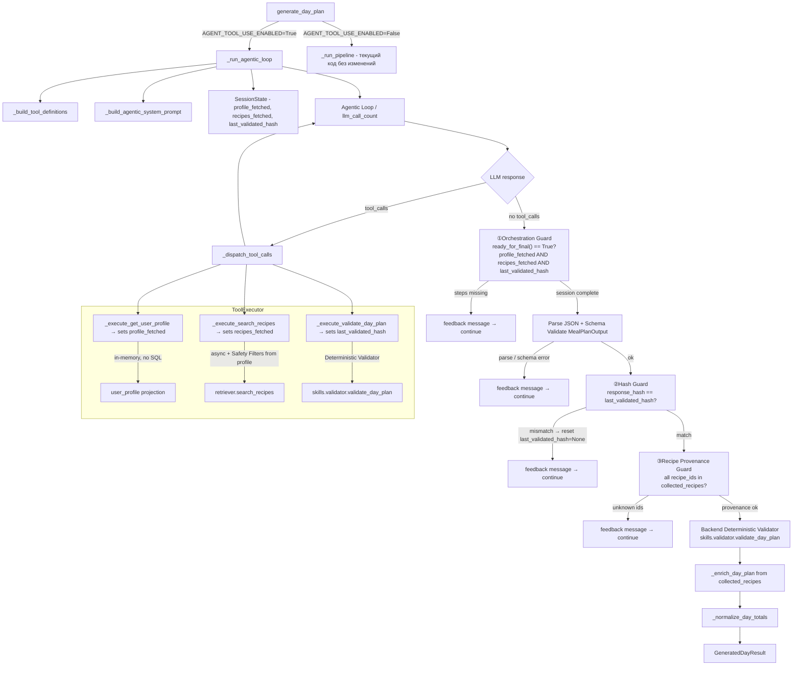

# Design Document — plan-agent-tools

> Исторический дизайн baseline. Расхождения с фактическим кодом и новая цель
> agentic-only: [реестр контрактов](../../../docs/agentic-only/CONTRACTS_AND_GAPS.md).
> Примеры ниже не являются основанием отключать действующие safety checks.

## Overview

Фича добавляет **tool-using режим** в существующий оркестратор генерации планов питания (`orchestrator.py`).
LLM самостоятельно запрашивает данные через OpenAI-style function calling.
Оркестратор отслеживает Session State и принимает финальный ответ только при выполнении всех
обязательных шагов и совпадении hash плана с последним провалидированным черновиком.

Переключение реализуется флагом `settings.AGENT_TOOL_USE_ENABLED` (по умолчанию `False`).

### Ключевые архитектурные решения

| Аспект | Было | Стало |
|---|---|---|
| Контекст рецептов | Все рецепты в системном промпте | LLM запрашивает итеративно через `search_recipes` |
| Обратная связь по валидации | Retry loop с дублированием | Tool Result прямо в итерации |
| Профиль пользователя | В системном промпте | Только через `get_user_profile`, projection |
| Гарантия валидации | Только backend retry | Session State guard + hash check + финальная серверная проверка |
| Источник `quality_status` | `_assess_quality` (отдельная логика) | Единственный Deterministic Validator (`skills.validator`) |
| Rate limit search | По успешным вызовам | По попыткам (до обращения к retriever) |
| Ошибки инструментов | `{"error": "..."}` | Структурированный Tool Error `{"ok": false, "error": {"code": ..., "message": ...}}` |
| `response_format` | `iteration > 0` | Только при `last_validated_hash != None` |

---

## Architecture

### Компоненты и поток данных



### Session State

```python
@dataclass
class AgentSessionState:
    profile_fetched: bool = False
    recipes_fetched: bool = False
    last_validated_hash: str | None = None  # sha256 of last valid plan JSON

    def ready_for_final(self) -> bool:
        return self.profile_fetched and self.recipes_fetched and self.last_validated_hash is not None

    def missing_steps(self) -> list[str]:
        missing = []
        if not self.profile_fetched:
            missing.append("get_user_profile")
        if not self.recipes_fetched:
            missing.append("search_recipes")
        if self.last_validated_hash is None:
            missing.append("validate_day_plan")
        return missing
```

---

## Components and Interfaces

### 1. Конфигурация — новые поля в `settings`

```python
# config.py additions
AGENT_TOOL_USE_ENABLED: bool = False
AGENT_MAX_LLM_CALLS: int = 10      # число обращений к LLM API (единственный лимит итераций)
AGENT_MAX_SEARCH_CALLS: int = 5    # попыток search_recipes за сессию (1–20)
```

**`AGENT_MAX_LLM_CALLS`** — один термин для одного понятия. Счётчик `llm_call_count` инкрементируется
при каждом HTTP-запросе к OpenRouter. Нет отдельных счётчиков «итераций», «циклов» и «retry».

---

### 2. Структурированный Tool Error

Все ошибки Tool Result используют единый формат:

```python
def _tool_error(code: str, message: str) -> dict:
    return {"ok": False, "error": {"code": code, "message": message}}
```

Domain-specific результаты (`search_recipes`, `validate_day_plan`) сохраняют свою структуру
при успехе, но используют `_tool_error` при ошибках.

Коды ошибок:
| Код | Инструмент | Причина |
|---|---|---|
| `PROFILE_UNAVAILABLE` | `get_user_profile` | `user_profile is None` |
| `INVALID_QUERY` | `search_recipes` | пустой/whitespace query |
| `INVALID_MEAL_TYPE` | `search_recipes` | недопустимый `meal_type` |
| `SEARCH_UNAVAILABLE` | `search_recipes` | исключение в retriever |
| `SEARCH_LIMIT_REACHED` | `search_recipes` | превышен `AGENT_MAX_SEARCH_CALLS` |
| `UNKNOWN_TOOL` | dispatch | неизвестное имя инструмента |
| `TOOL_EXECUTION_ERROR` | dispatch | неперехваченное исключение в исполнителе |

---

### 3. `_build_tool_definitions() -> list[dict]`

```python
def _build_tool_definitions() -> list[dict]:
    return [
        {
            "type": "function",
            "function": {
                "name": "get_user_profile",
                "description": (
                    "Возвращает профиль пользователя: целевой калораж, расписание приёмов пищи, "
                    "аллергены, предпочтения и заболевания. ОБЯЗАТЕЛЕН как первый вызов."
                ),
                "parameters": {"type": "object", "properties": {}, "required": []},
            },
        },
        {
            "type": "function",
            "function": {
                "name": "search_recipes",
                "description": (
                    "Семантический поиск рецептов. Safety filters применяются автоматически. "
                    "Вызывать для каждого типа приёма пищи отдельно."
                ),
                "parameters": {
                    "type": "object",
                    "properties": {
                        "query": {"type": "string", "description": "Текстовый поисковый запрос."},
                        "meal_type": {
                            "type": "string",
                            "enum": ["breakfast", "lunch", "dinner", "snack", "universal"],
                            "description": "Тип приёма пищи для фильтрации.",
                        },
                        "limit": {
                            "type": "integer",
                            "minimum": 1,
                            "maximum": 20,
                            "description": "Максимальное число рецептов (по умолчанию 10).",
                        },
                    },
                    "required": ["query"],
                },
            },
        },
        {
            "type": "function",
            "function": {
                "name": "validate_day_plan",
                "description": (
                    "Проверяет черновик плана дня. ОБЯЗАТЕЛЕН перед финальным ответом. "
                    "Возвращает is_valid, errors (всегда present), message."
                ),
                "parameters": {
                    "type": "object",
                    "properties": {
                        "plan": {"type": "object", "description": "Объект плана дня (DayPlan)."},
                    },
                    "required": ["plan"],
                },
            },
        },
    ]
```

`user_id` отсутствует во всех трёх schemas.

---

### 4. `_call_llm_with_tools(messages, tools, *, expect_final) -> dict`

```python
async def _call_llm_with_tools(
    messages: list[dict],
    tools: list[dict],
    *,
    expect_final: bool,  # True только когда last_validated_hash != None
) -> dict:
    payload: dict = {
        "model": settings.LLM_MODEL_NAME,
        "messages": messages,
        "temperature": 0,
        "max_tokens": settings.LLM_MAX_OUTPUT_TOKENS,
        "tools": tools,
        "tool_choice": "auto",
    }
    if expect_final:
        # Включается только когда ожидается финальный JSON после успешной валидации
        payload["response_format"] = {"type": "json_object"}

    async with httpx.AsyncClient(timeout=settings.LLM_TIMEOUT_SEC) as client:
        response = await client.post(
            f"{settings.OPENROUTER_BASE_URL}/chat/completions",
            headers={
                "Authorization": f"Bearer {settings.OPENROUTER_API_KEY}",
                "Content-Type": "application/json",
            },
            json=payload,
        )
        response.raise_for_status()
        return response.json()["choices"][0]
```

`expect_final = (session_state.last_validated_hash is not None)` — не `iteration > 0`.

---

### 5. `ToolExecutor` — диспетчер инструментов

```python
@dataclass
class ToolExecutor:
    user_profile: dict
    db_session: AsyncSession
    session_state: AgentSessionState = field(default_factory=AgentSessionState)
    search_call_count: int = 0          # попытки (до retriever), включая неуспешные
    collected_recipes: dict[str, dict] = field(default_factory=dict)  # id → recipe

    async def dispatch(self, tool_name: str, arguments: dict) -> dict:
        match tool_name:
            case "get_user_profile":
                return self._execute_get_user_profile()
            case "search_recipes":
                return await self._execute_search_recipes(arguments)
            case "validate_day_plan":
                return self._execute_validate_day_plan(arguments)
            case _:
                return _tool_error("UNKNOWN_TOOL", f"Unknown tool: '{tool_name}'")
```

---

### 6. Исполнители инструментов

#### `_execute_get_user_profile(self) -> dict`

```python
def _execute_get_user_profile(self) -> dict:
    if not self.user_profile:
        return _tool_error("PROFILE_UNAVAILABLE", "User profile is not available")
    self.session_state.profile_fetched = True
    return {
        "target_calories": self.user_profile["target_calories"],
        "meal_schedule": self.user_profile.get("meal_schedule") or [],
        "allergies": self.user_profile.get("allergies") or [],
        "disliked_ingredients": self.user_profile.get("disliked_ingredients") or [],
        "diseases": self.user_profile.get("diseases") or [],
        "preferences": self.user_profile.get("preferences") or [],
        "goal": self.user_profile.get("goal", ""),
    }
```

Никаких SQL. Возвращает только разрешённые поля (projection — служебные поля не передаются).

#### `_execute_search_recipes(self, arguments: dict) -> dict`

```python
async def _execute_search_recipes(self, arguments: dict) -> dict:
    # 1. Validation (не считается попыткой)
    query = arguments.get("query", "")
    if not query or not query.strip():
        return _tool_error("INVALID_QUERY", "query must not be empty")

    meal_type = arguments.get("meal_type")
    VALID_MEAL_TYPES = {"breakfast", "lunch", "dinner", "snack", "universal"}
    if meal_type and meal_type not in VALID_MEAL_TYPES:
        return _tool_error(
            "INVALID_MEAL_TYPE",
            f"Invalid meal_type. Allowed: {sorted(VALID_MEAL_TYPES)}"
        )

    # 2. Rate limit check ПЕРЕД попыткой
    if self.search_call_count >= settings.AGENT_MAX_SEARCH_CALLS:
        return _tool_error("SEARCH_LIMIT_REACHED", "Recipe search call limit reached for this session")

    # 3. Инкрементируем ДО обращения к retriever (считаем попытки, а не успехи)
    self.search_call_count += 1

    limit_requested = int(arguments.get("limit", 10))
    limit = min(limit_requested, 20)
    clamped = limit_requested > 20

    # 4. Safety Filters из server-side user_profile — LLM не может их изменить
    try:
        results = await search_recipes(
            self.db_session,
            allergies=self.user_profile.get("allergies") or [],
            dislikes=self.user_profile.get("disliked_ingredients") or [],
            diseases=self.user_profile.get("diseases") or [],
            preferred_tags=self.user_profile.get("preferences") or [],
            semantic_query=query.strip(),
            limit=limit,
        )
    except Exception as exc:
        logger.exception("search_recipes retriever error: {}", exc)  # полный exc в logs
        return _tool_error("SEARCH_UNAVAILABLE", "Recipe search is temporarily unavailable")

    # 5. Фильтрация по meal_type
    if meal_type:
        COMPATIBLE = {
            "breakfast": {"breakfast", "universal"},
            "lunch": {"lunch", "lunch/dinner", "universal"},
            "dinner": {"dinner", "lunch/dinner", "universal"},
            "snack": {"snack", "universal"},
            "universal": VALID_MEAL_TYPES | {"lunch/dinner"},
        }
        compatible = COMPATIBLE.get(meal_type, {meal_type})
        results = [r for r in results if r.get("meal_type") in compatible]

    if not results:
        return {"recipes": [], "message": "No recipes found matching the given criteria and safety filters"}

    # 6. Собираем для enrich + обновляем session state
    recipe_list = []
    for r in results:
        recipe_id = r["id"] if isinstance(r, dict) else str(r.id)
        self.collected_recipes[recipe_id] = r
        recipe_list.append({
            "id": recipe_id,
            "title": r.get("title", ""),
            "meal_type": r.get("meal_type", "universal"),
            "calories": r.get("calories", 0),
            "protein": r.get("protein", 0),
            "fat": r.get("fat", 0),
            "carbs": r.get("carbs", 0),
            "tags": r.get("tags") or [],
        })

    self.session_state.recipes_fetched = True
    response: dict = {"recipes": recipe_list}
    if clamped:
        response["message"] = "limit clamped to 20"
    return response
```

#### `_execute_validate_day_plan(self, arguments: dict) -> dict`

```python
def _execute_validate_day_plan(self, arguments: dict) -> dict:
    plan_data = arguments.get("plan")
    try:
        plan = DayPlan.model_validate(plan_data)
    except (ValidationError, TypeError, ValueError) as exc:
        self.session_state.last_validated_hash = None
        return {"is_valid": False, "errors": [f"Schema validation error: {exc}"], "message": None}

    target_calories = self.user_profile["target_calories"]
    meal_schedule = self.user_profile.get("meal_schedule")

    try:
        is_valid, error_msg = validate_day_plan(plan, target_calories, meal_schedule=meal_schedule)
    except Exception as exc:
        logger.exception("validate_day_plan internal error: {}", exc)
        self.session_state.last_validated_hash = None
        return {"is_valid": False, "errors": [f"Internal validation error: {exc}"], "message": None}

    errors = [error_msg] if (not is_valid and error_msg) else []

    if errors:
        self.session_state.last_validated_hash = None
        return {"is_valid": False, "errors": errors, "message": None}

    # Успешная валидация — фиксируем hash черновика
    plan_hash = _compute_plan_hash(plan_data)
    self.session_state.last_validated_hash = plan_hash
    return {"is_valid": True, "errors": [], "message": "План соответствует всем требованиям"}
```

`validate_day_plan` всегда возвращает `errors` (пустой или непустой). Инвариант:
`result["is_valid"] == (result["errors"] == [])` без исключений.

---

### 7. `_compute_plan_hash(plan_data: dict) -> str`

```python
import hashlib, json

def _compute_plan_hash(plan_data: Any) -> str:
    """Детерминированный sha256 словаря плана для проверки идентичности черновика и финала."""
    canonical = json.dumps(plan_data, sort_keys=True, ensure_ascii=False)
    return hashlib.sha256(canonical.encode()).hexdigest()
```

---

### 8. `_run_agentic_loop` — основной цикл

```python
async def _run_agentic_loop(
    user_profile: dict,
    db_session: AsyncSession,
    day_number: int,
    *,
    previous_day_titles: list[str] | None = None,
    avoid_recipe_ids: set[str] | None = None,
) -> GeneratedDayResult:
    if not settings.AGENT_TOOL_USE_ENABLED:
        raise AgentConfigurationError("Agentic loop entered with AGENT_TOOL_USE_ENABLED=False")

    tools = _build_tool_definitions()
    executor = ToolExecutor(user_profile=user_profile, db_session=db_session)
    system_prompt = _build_agentic_system_prompt()
    messages: list[dict] = [
        {"role": "system", "content": system_prompt},
        {"role": "user", "content": f"Составь план питания на день {day_number}."},
    ]
    tool_call_trace: list[dict] = []
    llm_call_count = 0
    max_llm_calls = settings.AGENT_MAX_LLM_CALLS

    while llm_call_count < max_llm_calls:
        expect_final = executor.session_state.last_validated_hash is not None
        choice = await _call_llm_with_tools(messages, tools, expect_final=expect_final)
        llm_call_count += 1
        message = choice["message"]
        tool_calls = message.get("tool_calls") or []

        if not tool_calls:
            # --- Orchestration Guard ---
            if not executor.session_state.ready_for_final():
                missing = executor.session_state.missing_steps()
                feedback = (
                    f"You must complete these steps before returning the final plan: "
                    f"{', '.join(missing)}. "
                    f"Call the missing tools first."
                )
                messages.append({"role": "user", "content": feedback})
                continue

            # --- Parse & schema validate ---
            raw_content = message.get("content", "")
            try:
                parsed_json = json.loads(raw_content)
            except json.JSONDecodeError as exc:
                messages.append({"role": "user", "content": f"Invalid JSON: {exc}. Return valid JSON."})
                continue
            try:
                output = MealPlanOutput.model_validate(parsed_json)
            except ValidationError as exc:
                messages.append({"role": "user", "content": f"Schema error: {exc}. Fix the structure."})
                continue

            # --- Hash Guard ---
            response_hash = _compute_plan_hash(parsed_json.get("day") or parsed_json)
            if response_hash != executor.session_state.last_validated_hash:
                messages.append({
                    "role": "user",
                    "content": (
                        "The returned plan differs from the last validated version. "
                        "Please validate the exact plan you intend to submit."
                    ),
                })
                executor.session_state.last_validated_hash = None  # сбрасываем
                continue

            # --- Recipe Provenance Guard ---
            used_ids = {meal.recipe_id for meal in output.day.meals}
            allowed_ids = set(executor.collected_recipes.keys())
            unknown_ids = used_ids - allowed_ids
            if unknown_ids:
                messages.append({
                    "role": "user",
                    "content": (
                        f"Plan contains recipe IDs not returned by search_recipes in this session: "
                        f"{sorted(unknown_ids)}. Use only recipes from search results."
                    ),
                })
                continue

            # --- Backend Deterministic Final Validation ---
            plan = output.day
            plan.day_number = day_number
            plan = _normalize_day_totals(plan)
            backend_valid, backend_error = validate_day_plan(
                plan,
                user_profile["target_calories"],
                meal_schedule=user_profile.get("meal_schedule"),
            )
            quality_status = "valid" if backend_valid else "partially_valid"

            # --- Enrich & return ---
            enriched = _enrich_day_plan(plan, list(executor.collected_recipes.values()))
            _log_agentic_summary(llm_call_count, executor, quality_status)
            return GeneratedDayResult(
                plan=enriched,
                quality_status=quality_status,
                attempts_used=llm_call_count,
                validation_error=backend_error,
                tool_call_trace=tool_call_trace,
            )

        # --- Tool calls branch ---
        messages.append({"role": "assistant", "content": None, "tool_calls": tool_calls})
        for tc in tool_calls:
            tool_name = tc["function"]["name"]
            try:
                args = json.loads(tc["function"].get("arguments", "{}"))
            except json.JSONDecodeError:
                args = {}

            args_summary = _build_args_summary(args)
            logger.debug("[agentic] llm_call={} tool={} args={}", llm_call_count, tool_name, args_summary)

            try:
                result = await executor.dispatch(tool_name, args)
            except Exception as exc:
                result = _tool_error("TOOL_EXECUTION_ERROR", str(exc))

            result_repr = str(result)[:200]
            logger.debug("[agentic] llm_call={} tool={} result={}", llm_call_count, tool_name, result_repr)
            tool_call_trace.append({"tool": tool_name, "llm_call": llm_call_count, "args_summary": args_summary})
            messages.append({
                "role": "tool",
                "tool_call_id": tc["id"],
                "content": json.dumps(result, ensure_ascii=False),
            })

    raise AgentLimitError(
        llm_calls=llm_call_count,
        pending_tool_call_ids=[tc["id"] for tc in (message.get("tool_calls") or [])],
    )
```

---

### 9. Новые исключения

```python
class AgentLimitError(Exception):
    """Превышен AGENT_MAX_LLM_CALLS."""
    def __init__(self, llm_calls: int, pending_tool_call_ids: list[str]):
        self.llm_calls = llm_calls
        self.pending_tool_call_ids = pending_tool_call_ids
        super().__init__(
            f"Agent LLM call limit reached after {llm_calls} calls. "
            f"Pending tool calls: {pending_tool_call_ids}"
        )

class AgentConfigurationError(Exception):
    """Ошибка конфигурации агента."""
    pass
```

**Переименование:** `AgentIterationLimitError` → `AgentLimitError`. Единственный счётчик — `llm_calls`.

---

### 10. Новый системный промпт `system_tool_use` в `meal_plan.yml`

Ключ `system_tool_use` не содержит ни списка рецептов, ни полей профиля.
Содержит явный обязательный порядок:

```
Обязательная последовательность:
1. get_user_profile — всегда первым
2. search_recipes — для каждого типа приёма пищи из расписания
3. Сформировать черновик плана, используя ТОЛЬКО id рецептов из текущей сессии
4. validate_day_plan — обязательно перед финальным ответом
5. Вернуть финальный JSON ТОЛЬКО если validate_day_plan вернул is_valid: true
   и план не изменился после валидации
```

---

## Data Models

### `GeneratedDayResult` — расширенная схема

```python
@dataclass
class GeneratedDayResult:
    plan: DayPlanFull
    quality_status: str                          # "valid" | "partially_valid"
    attempts_used: int                           # число LLM-вызовов
    validation_error: str | None = None
    tool_call_trace: list[dict] = field(default_factory=list)
    # Каждый элемент: {"tool": str, "llm_call": int, "args_summary": str}
```

В pipeline-режиме `tool_call_trace` остаётся пустым списком.

### Tool Result — структуры ответов

#### `get_user_profile` (success)
```json
{
  "target_calories": 2000,
  "meal_schedule": [{"type": "breakfast", "time": "08:00", "calories_pct": 25}],
  "allergies": ["орехи"],
  "disliked_ingredients": [],
  "diseases": [],
  "preferences": ["высокобелковый"],
  "goal": "lose"
}
```

#### `get_user_profile` (error)
```json
{"ok": false, "error": {"code": "PROFILE_UNAVAILABLE", "message": "User profile is not available"}}
```

#### `search_recipes` (success)
```json
{
  "recipes": [
    {"id": "uuid", "title": "Овсянка", "meal_type": "breakfast",
     "calories": 320, "protein": 12.5, "fat": 6.0, "carbs": 55.0, "tags": ["завтрак"]}
  ]
}
```

#### `search_recipes` (error)
```json
{"ok": false, "error": {"code": "SEARCH_UNAVAILABLE", "message": "Recipe search is temporarily unavailable"}}
```

#### `validate_day_plan` (success)
```json
{"is_valid": true, "errors": [], "message": "План соответствует всем требованиям"}
```

#### `validate_day_plan` (failure)
```json
{"is_valid": false, "errors": ["Отклонение от целевого калоража: 1850 vs 2000 (7.5%)"], "message": null}
```

### Новые поля в `settings`

| Поле | Тип | По умолчанию | Описание |
|---|---|---|---|
| `AGENT_TOOL_USE_ENABLED` | `bool` | `False` | Включает tool-using режим |
| `AGENT_MAX_LLM_CALLS` | `int` | `10` | Лимит обращений к LLM API (единственный счётчик) |
| `AGENT_MAX_SEARCH_CALLS` | `int` | `5` | Лимит попыток `search_recipes` за сессию (1–20) |

---

## Correctness Properties

### Property 1: JSON Schema инструментов — обязательные поля, user_id отсутствует

*Для каждого* инструмента из `_build_tool_definitions()`: содержит `name`, `description`, `parameters.type == "object"`, `parameters.properties`; не содержит `user_id` ни в `properties`, ни в `required`.

**Validates: Req 1.5, 11.1**

---

### Property 2: Системный промпт не содержит данные профиля

*Для любого* `user_profile` с произвольными значениями полей — строка `_build_agentic_system_prompt()` не содержит конкретных значений `target_calories`, `allergies`, `goal`, `preferences`, `disliked_ingredients`, `diseases`, `meal_schedule`.

**Validates: Req 2.5, 9.3**

---

### Property 3: `get_user_profile` возвращает все 7 обязательных полей

*Для любого* валидного `user_profile` — Tool Result содержит все 7 полей; `target_calories` — int > 0; списковые поля — `list`.

**Validates: Req 2.1**

---

### Property 4: Пустой/whitespace query отклоняется без вызова retriever

*Для любой* строки из whitespace-символов (включая пустую) — `_execute_search_recipes` возвращает Tool Error с `code: "INVALID_QUERY"`; retriever не вызывается; `search_call_count` не инкрементируется.

**Validates: Req 3.2**

---

### Property 5A: Executor всегда передаёт Safety Filters из server-side profile в retriever

*Для любых* аргументов LLM и любого `user_profile` с непустыми `allergies`/`disliked_ingredients`/`diseases` — вызов retriever из `_execute_search_recipes` содержит эти поля из `self.user_profile`, а не из аргументов LLM.

**Validates: Req 11.2**

---

### Property 5B: Retriever исключает рецепты с запрещёнными аллергенами

*Для любого* набора рецептов и любого непустого списка аллергенов — ни один рецепт, возвращённый `search_recipes` из retriever, не содержит аллерген из переданного списка.

**Validates: Req 3.4**

---

### Property 6: Фильтрация по `meal_type` — все результаты совместимы

*Для любого* допустимого `meal_type` — все рецепты в `result["recipes"]` имеют совместимый `meal_type` (с учётом `lunch/dinner` mapping).

**Validates: Req 3.7**

---

### Property 7: `limit > 20` всегда clamped до 20

*Для любого* `limit > 20` — `len(result["recipes"]) <= 20` и `result["message"] == "limit clamped to 20"`.

**Validates: Req 3.10**

---

### Property 8: `validate_day_plan` — инвариант `is_valid ↔ errors == []`

*Для любого* входного плана — `result["is_valid"] == (result["errors"] == [])`. Поле `errors` всегда присутствует.

**Validates: Req 4.3**

---

### Property 9: `validate_day_plan` фиксирует `last_validated_hash` при успехе и сбрасывает при неуспехе

*Для любого* плана, прошедшего валидацию — `session_state.last_validated_hash == _compute_plan_hash(plan_data)`. *Для любого* невалидного плана — `session_state.last_validated_hash is None`.

**Validates: Req 4.8, 4.9**

---

### Property 10: Session State Guard блокирует финальный ответ при незавершённых шагах

*Для любого* Session State с `ready_for_final() == False` — Loop добавляет feedback message и продолжается; `GeneratedDayResult` не возвращается.

**Validates: Req 5.1, 7.7**

---

### Property 11: Hash Guard отклоняет изменённый план

*Для любого* финального ответа, hash которого не совпадает с `last_validated_hash` — Loop добавляет feedback message; `last_validated_hash` сбрасывается в `None`.

**Validates: Req 5.3, 5.4**

---

### Property 12: Recipe Provenance Guard — все `recipe_id` из `collected_recipes`

*Для любого* финального плана, содержащего хотя бы один `recipe_id` не из `collected_recipes` — Loop добавляет feedback message; `GeneratedDayResult` не возвращается.

**Validates: Req 6.1, 6.2**

---

### Property 13: `_normalize_day_totals` — инвариант суммы калорий

`plan.total_calories == round(sum(meal.calories for meal in plan.meals))` после вызова.

**Validates: Req 8.3**

---

### Property 14: Round-trip `MealPlanOutput`

`MealPlanOutput.model_validate(json.loads(obj.model_dump_json()))` эквивалентен исходному объекту.

**Validates: Req 8.1**

---

### Property 15: Обратная совместимость — pipeline при `AGENT_TOOL_USE_ENABLED=False`

При `AGENT_TOOL_USE_ENABLED=False` — `ToolExecutor` не создаётся; LLM-запросы не содержат поле `tools`.

**Validates: Req 10.2, 10.4**

---

### Property 16: Rate limit по попыткам — после `AGENT_MAX_SEARCH_CALLS` попыток

*Для любого* `AGENT_MAX_SEARCH_CALLS` (1–20) — после `AGENT_MAX_SEARCH_CALLS` вызовов с валидными аргументами (включая упавшие в retriever) все последующие вызовы возвращают Tool Error с `code: "SEARCH_LIMIT_REACHED"` без обращения к retriever.

**Validates: Req 11.4, 11.5**

---

### Property 17: `tool_call_trace` полноценно отражает все вызовы

*Для* N выполненных вызовов инструментов — `len(tool_call_trace) == N`; каждая запись содержит `tool`, `llm_call`, `args_summary` (str ≤ 200 символов, без `user_id` и полей профиля).

**Validates: Req 12.3**

---

### Property 18: Порядок messages — assistant предшествует tool results

*Для любого* набора `tool_calls` — `role: "assistant"` с `tool_calls` предшествует всем соответствующим `role: "tool"`; порядок tool results совпадает с порядком tool_calls.

**Validates: Req 7.1, 7.4, 7.5**

---

## Error Handling

### Иерархия ошибок

```
AgentConfigurationError  — неверная конфигурация (вход в loop при AGENT_TOOL_USE_ENABLED=False)
AgentLimitError          — превышен AGENT_MAX_LLM_CALLS (содержит llm_calls и pending_tool_call_ids)
httpx.HTTPError          — сетевая ошибка LLM API (не перехватывается внутри loop)
```

### Стратегия resilience

| Ситуация | Guard / механизм | Поведение |
|---|---|---|
| Session State неполный при попытке финала | ①Orchestration Guard | Feedback message, loop продолжается |
| Hash mismatch (финальный план ≠ провалидированный черновик) | ②Hash Guard | Feedback message, `last_validated_hash = None`, loop продолжается |
| Unknown `recipe_id` в плане | ③Recipe Provenance Guard | Feedback message, loop продолжается |
| Инструмент бросает исключение | ToolExecutor dispatch | Tool Error `TOOL_EXECUTION_ERROR`, loop продолжается |
| Неизвестный инструмент | ToolExecutor dispatch | Tool Error `UNKNOWN_TOOL`, loop продолжается |
| Retriever упал | `_execute_search_recipes` | Tool Error `SEARCH_UNAVAILABLE`, `repr(exc)` только в logs, loop продолжается |
| Невалидный JSON в финальном ответе | Parse step (до гардов) | Feedback message, loop продолжается |
| `AGENT_MAX_LLM_CALLS` исчерпан | Agentic Loop | `AgentLimitError` поднимается до caller |

---

## Testing Strategy

### Property → Test file mapping

| Property | Файл | Тип |
|---|---|---|
| P1 | `test_tool_definitions.py` | pytest |
| P2 | `test_tool_definitions.py` | Hypothesis |
| P3 | `test_tool_executor.py` | Hypothesis |
| P4 | `test_tool_executor.py` | Hypothesis |
| P5A | `test_tool_executor.py` | Hypothesis |
| P5B | `test_retriever_safety.py` | Hypothesis |
| P6 | `test_tool_executor.py` | Hypothesis |
| P7 | `test_tool_executor.py` | Hypothesis |
| P8 | `test_tool_executor.py` | pytest |
| P9 | `test_tool_executor.py` | pytest |
| P10 | `test_agentic_loop.py` | pytest |
| P11 | `test_agentic_loop.py` | pytest |
| P12 | `test_agentic_loop.py` | pytest |
| P13 | `test_normalize.py` | Hypothesis |
| P14 | `test_round_trip.py` | Hypothesis |
| P15 | `test_orchestrator_compat.py` | Hypothesis |
| P16 | `test_tool_executor.py` | Hypothesis |
| P17 | `test_tool_executor.py` | Hypothesis |
| P18 | `test_agentic_loop.py` | Hypothesis |

### Конфигурация Hypothesis

```python
from hypothesis import settings, HealthCheck
settings.register_profile("ci", max_examples=200, suppress_health_check=[HealthCheck.too_slow])
settings.register_profile("dev", max_examples=50)
```
