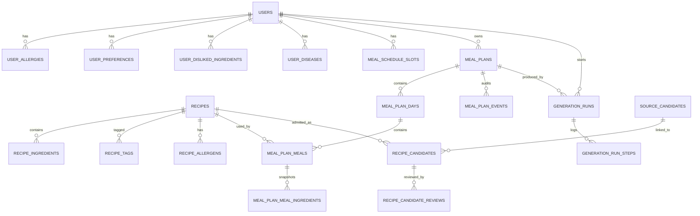

# Архитектура хранения данных NutriAgent

## Цель

PostgreSQL является единственным долговременным источником истины. Доменные данные не хранятся JSON-документами: профиль пользователя, состав рецепта, дни плана, блюда, ингредиенты и события плана разложены по нормализованным таблицам.

Redis и `localStorage` не заменяют БД. Они нужны только для скорости и UX.

## Хранилища

| Хранилище | Роль | Что можно потерять |
|---|---|---|
| PostgreSQL + pgvector | Аккаунты, nutrition profile, каталог рецептов, планы питания, строки дней/блюд/ингредиентов, события, trace генераций, embeddings | Нельзя терять |
| Redis | Celery broker/result backend, live progress, короткий TTL-кэш профиля/рецептов/ответов плана/списка покупок | Можно сбросить, данные восстанавливаются из PostgreSQL |
| Frontend `localStorage` | JWT/session hints, `userId`, `taskId`, `planId`, черновик формы | Можно сбросить, backend не доверяет без проверки |
| JSON-файлы репозитория | Seed/config/import input | Не runtime source of truth после импорта |

## PostgreSQL

### Users

`users` хранит аккаунт и базовые поля анкеты: email, password hash, age, weight, height, gender, activity level, goal, calculated target calories.

Списки профиля вынесены отдельно:

| Таблица | Что хранит |
|---|---|
| `user_allergies` | аллергены пользователя |
| `user_preferences` | предпочтения и diet tags |
| `user_disliked_ingredients` | нежелательные ингредиенты |
| `user_diseases` | медицинские/диетические ограничения |
| `meal_schedule_slots` | расписание приемов пищи: порядок, тип, время, процент калорий |

### Recipes

`recipes` хранит карточку рецепта и макро-поля: title, description, calories, protein, fat, carbs, meal type, category, preparation time, short ingredient summary, pgvector embedding.

Состав рецепта вынесен отдельно:

| Таблица | Что хранит |
|---|---|
| `recipe_ingredients` | ингредиенты с позицией, количеством и единицей измерения |
| `recipe_tags` | теги рецепта |
| `recipe_allergens` | аллергены рецепта |

### Meal Plans

`meal_plans` хранит только шапку плана: owner, status, date range, timestamps.

Содержимое плана хранится строками:

| Таблица | Что хранит |
|---|---|
| `meal_plan_days` | день плана, дата и дневные totals |
| `meal_plan_meals` | конкретный прием пищи, ссылка на рецепт, planned time, title/macros snapshot, portion factor |
| `meal_plan_meal_ingredients` | ingredient snapshot блюда в плане |
| `meal_plan_events` | audit событий плана: создание, swap, cancel, изменения статуса |

API по-прежнему может отдавать `plan_data` как собранный DTO, но он строится из строк PostgreSQL и кэшируется в Redis. В PostgreSQL колонки `meal_plans.plan_data` больше нет.

### Generation Runs

`generation_runs` и `generation_run_steps` делают историю генераций долговременной: task id, mode, status, quality status, model/prompt metadata, ошибки и шаги. Redis остается только live-progress слоем.

### Catalog Staging

`recipe_candidates`, `recipe_candidate_reviews` и `source_candidates` отделяют недоверенный ingest от канонического каталога рецептов. Принятый рецепт попадает в `recipes` и связанные нормализованные таблицы; rejected/review записи остаются как аудит качества источников.

## Связи

## Redis

Redis хранит только временные данные:

| Ключ/слой | Что хранит |
|---|---|
| Celery broker/result backend | очередь задач, текущий прогресс, краткий результат задачи |
| `user:{user_id}` | кэш собранного профиля пользователя |
| `recipes:all` | кэш каталога рецептов для быстрого retrieval |
| `plan:{plan_id}` | короткий кэш DTO плана сразу после генерации |
| `plans:response:v1:{plan_id}` | кэш ответа `/api/plans/{id}` |
| `plans:shopping-list:v1:{plan_id}` | кэш агрегированного списка покупок |

Инвариант: после очистки Redis готовый план, профиль и каталог должны восстанавливаться из PostgreSQL.

## Frontend localStorage

Фронт хранит только клиентское состояние: токен, id пользователя, id задачи, id плана, draft onboarding формы. Эти данные ускоряют восстановление экрана после перезагрузки, но не являются доверенным источником. Backend всегда проверяет JWT и читает доменные данные из PostgreSQL.

## Миграции

Исполняемый источник схемы - Alembic:

1. `e5a1c2d3f4b5` объединяет старые Alembic heads.
2. `9f0a1b2c3d4e` добавляет нормализованные таблицы, индексы, constraints, triggers и backfill из старых JSON/ARRAY колонок.
3. `c6d7e8f9a0b1` удаляет legacy JSON/ARRAY доменные колонки из `users`, `recipes`, `meal_plans`.

Down-миграции оставлены для отката схемы, но целевое состояние проекта - normalized PostgreSQL без доменных JSON snapshot колонок.

## Итоговая архитектура

Фронт идет на backend. Backend:

1. проверяет auth/session;
2. читает быстрый ответ из Redis, если кэш валиден;
3. при cache miss собирает данные из нормализованных таблиц PostgreSQL;
4. для генерации вызывает LLM/agent flow;
5. сохраняет результат в PostgreSQL строками;
6. кладет короткий DTO в Redis для скорости.

Так БД остается нормализованной и пригодной для SQL-запросов, триггеров, индексов, проверок целостности и аналитики.
